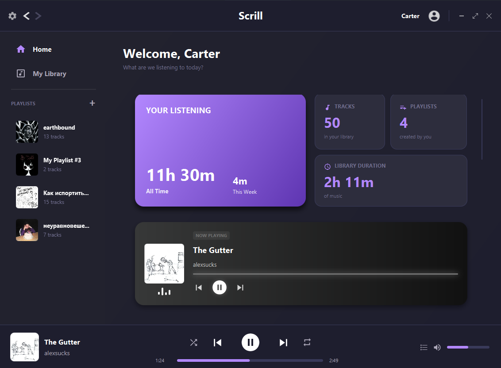
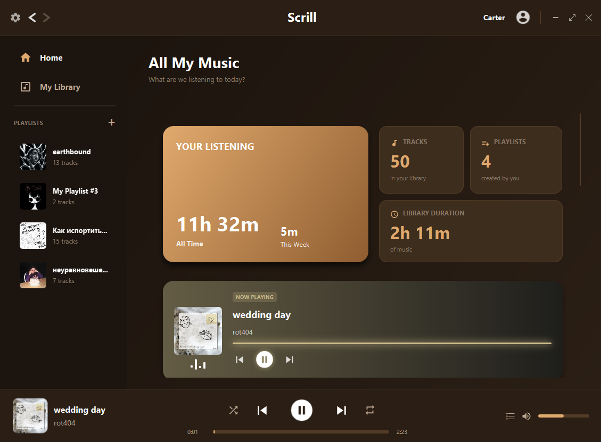
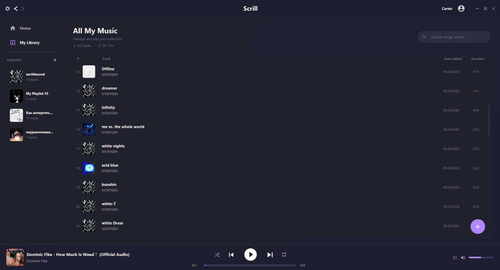
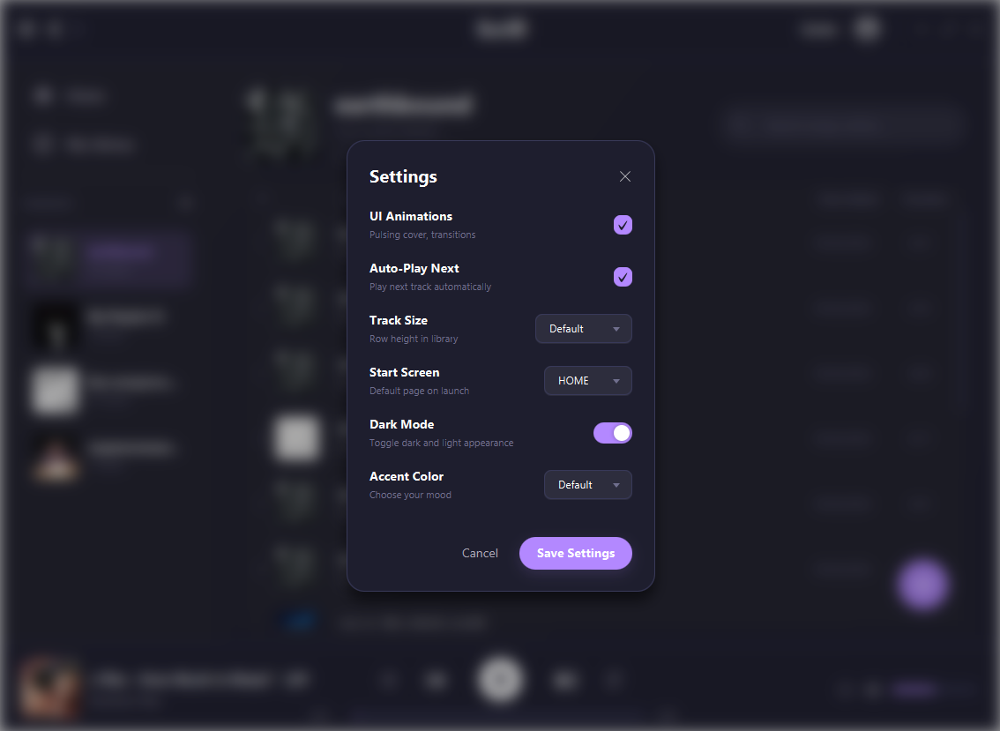
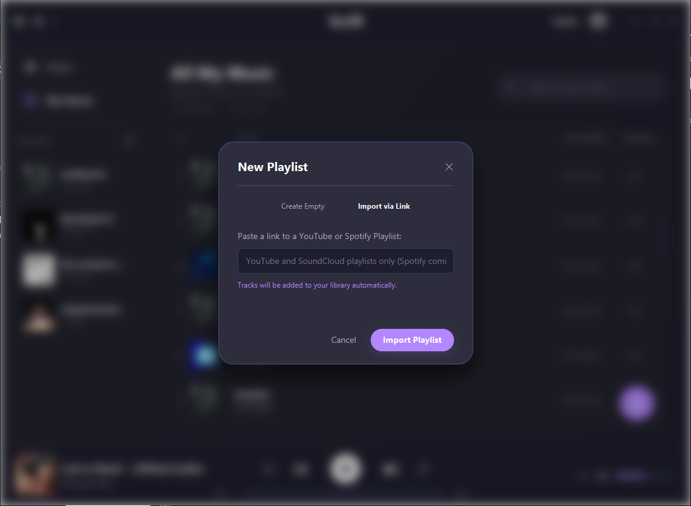
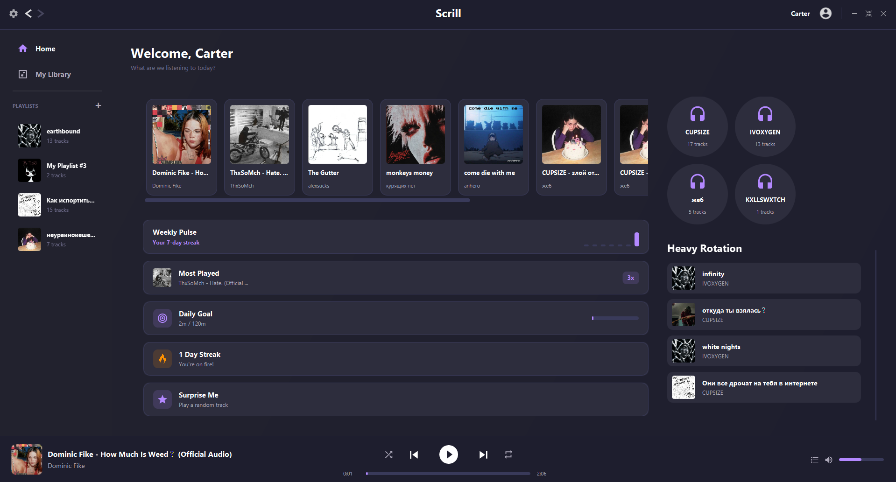

```markdown
# 🎵 Scrill Music Player

A modern, feature-rich desktop music player built with JavaFX.


## Screenshots

### 🏠 Home Dashboard

*Personal dashboard with listening stats, Now Playing widget and Jump Back In*

### 🎨 Theme Support

*7 accent colors × Dark/Light mode = 14 unique themes*

### 📚 Music Library

*Full library view with search, sortable columns and context menu*

### ⚙️ Settings

*Customizable animations, track size, start screen and accent color*

### ➕ Add Music

*Import playlists from YouTube or add tracks manually/by link*

### 📊 Stats & Widgets

*Weekly pulse, daily goal, streak tracker and most played*

## Features

- 🎵 Local music library management
- 📋 Custom playlists
- 🔍 Search by title and artist
- ⬇️ Download music via YouTube links or search
- 📥 Import YouTube or SoundCloud playlists
- 👤 Multiple user profiles
- 🎨 Multiple themes (Dark, Light, Red, Green, Pink, Nordic, Cream, Penguin)
- 📊 Listening statistics and streaks
- 🔀 Shuffle and repeat modes
- 📝 Queue system
- ✏️ Edit track metadata

## Requirements

- Windows 10/11
- No Java installation required (bundled with installer)

## Installation

1. Download the latest `Scrill-1.0.0.exe` from [Releases]
2. Run the installer
3. Choose installation directory
4. Launch Scrill from desktop shortcut

## Building from Source

### Prerequisites
- JDK 17+
- Maven (or use included `mvnw`)

### Steps
```bash
git clone https://github.com/Watero-o/Scrill.git
cd Scrill
mvnw clean package
```

### Tools Required for Download Features
Place these in `tools/` folder:
- [yt-dlp](https://github.com/yt-dlp/yt-dlp/releases) → `tools/yt-dlp.exe`
- [ffmpeg](https://ffmpeg.org/download.html) → `tools/ffmpeg.exe`

## Project Structure
```

src/main/java/com/example/scrill/
├── controller/          # Business logic controllers
│   ├── LibraryController.java
│   ├── NavigationController.java
│   ├── PlayerController.java
│   ├── ProfileController.java
│   └── SettingsController.java
├── ui/                  # UI builders
│   ├── DashboardBuilder.java
│   ├── ModalManager.java
│   └── SidebarController.java
├── util/                # Utilities
│   ├── SpotifyHelper.java
│   ├── StatsManager.java
│   └── ThemeManager.java
└── HelloController.java # Main controller
```


## Tech Stack

- **Java 17**
- **JavaFX 17** — UI framework
- **jaudiotagger** — MP3 metadata reading
- **yt-dlp** — YouTube downloading
- **ffmpeg** — Audio conversion
- **Ikonli** — Icon library

## License

MIT License — see [LICENSE](LICENSE) file
```
